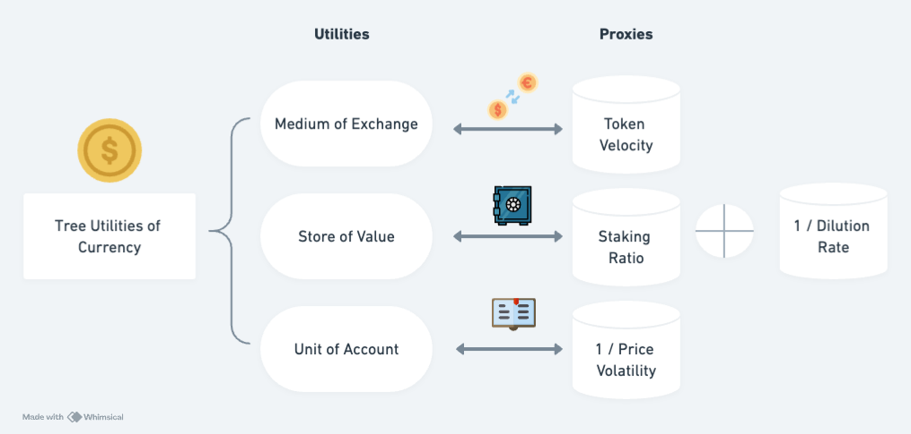

### Cryptocurrency Valuation: An Explainable AI Approach

The paper and highlights the significant role of on-chain data in the Price-to-Utility (PU) ratio and its application to cryptocurrency trading. Let's enhance this analysis by incorporating insights from on-chain analysis techniques.

#### Connections and Complements:

**UTXO Model Deep Dive:**
- **Creation and Tracking**: The UTXO model is fundamental in understanding how transactions are processed on the blockchain. Each UTXO represents a chunk of digital currency that has not been spent and can be tracked from its creation to when it is spent.
- **Age Distribution Analysis**: Tools like CryptoQuant allow users to analyze the age distribution of UTXOs, providing deeper insights into Bitcoin’s use as a store of value. This can further refine the staking ratio calculation in the PU ratio.

**Beyond Token Velocity:**
- **Transaction Volume**: This metric reveals the total economic activity on the blockchain and, combined with token velocity, helps assess the network usage trends.
- **Active Addresses**: The number of active addresses offers insights into user adoption and network growth.
- **Transaction Fees**: Observing transaction fee trends helps gauge network congestion and user demand for blockchain space, reflecting the blockchain's capacity and health.

**Miners and Market Dynamics:**
- **Miner Outflow**: Tracks Bitcoin transfers from miners to exchanges, potentially signaling selling pressure or profit-taking.
- **Hash Rate**: The computational power securing the network, reflecting miner confidence and the overall security of the network.
- **Miner Revenue**: Insight into the economic incentives driving miners, which can influence their behavior and impact the Bitcoin supply.

> This is all great, but how do we collect this data?

**Exchange Flows and Whale Movements:**
- **Exchange Balances**: Tracking inflows and outflows from exchanges can highlight the balance between buying and selling pressures, crucial for market sentiment analysis.
- **Whale Transactions**: Large transactions by significant holders can significantly influence market direction and provide insights into the behavior of influential market participants.

**Market Cycle Analysis:**
- **On-Chain Indicators**: Tools like MVRV Z-Score and Net Unrealized Profit/Loss (NUPL) help assess the market's stage in its cycle, crucial for contextualizing the PU ratio’s signals within broader market conditions.

**Additional On-Chain Metrics:**
- **Network Health**: Metrics such as the number of unconfirmed transactions and node count.
- **Investor Sentiment**: Indicators that track social media and news sentiment regarding Bitcoin.
- **On-Chain Derivatives Activity**: Advanced metrics that could indicate speculative or hedging activities occurring directly on-chain.

> Again all great. But, how it's collected?

#### Integration and Real-Time Adaptability:
- **Holistic Approach**: By integrating these insights, a more comprehensive framework for cryptocurrency valuation and trading can be developed, enhancing the utility of the PU ratio.
- **Dynamic Adaptability**: Incorporating real-time on-chain data can significantly improve the responsiveness of trading strategies based on the PU ratio, allowing for adjustments to market shifts and new information.

